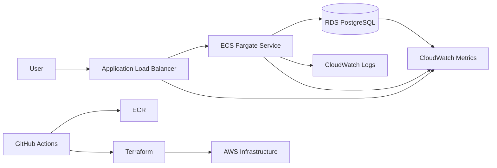

# Architecture

## High-Level View



## Network Design

- VPC spans two Availability Zones.
- Public subnets contain the Application Load Balancer and NAT Gateway.
- Private subnets contain ECS tasks and RDS PostgreSQL.
- RDS has no public endpoint.
- ECS tasks do not receive public IP addresses.

Traffic path:

```text
Internet -> ALB -> ECS task -> RDS PostgreSQL
```

## Compute

ECS Fargate was selected because it avoids EC2 host management while still giving production-grade primitives:

- task definitions
- service deployments
- autoscaling
- IAM roles for tasks
- CloudWatch log integration
- ALB integration

## Database

RDS PostgreSQL is used for managed backups, patching, encryption, and operational metrics.

The database password is generated by Terraform and stored in Secrets Manager. ECS injects the password into the container at runtime.

## Observability

Application logs are JSON-formatted and written to stdout. ECS sends them to CloudWatch Logs.

ALB access logs are centralized in S3 with encryption and lifecycle retention.

Metrics come from:

- ALB CloudWatch metrics for request rate, errors, and latency
- ECS metrics for CPU and memory
- RDS metrics for database health
- `/metrics` endpoint for app-level Prometheus-style metrics

Two dashboards are created:

- application dashboard
- database dashboard

## Deployment

PRs run validation, tests, and scans.

Merges to `main` build and push an image, deploy staging, and run a smoke test.

Production deployment is manually triggered and protected by a GitHub Environment approval.
